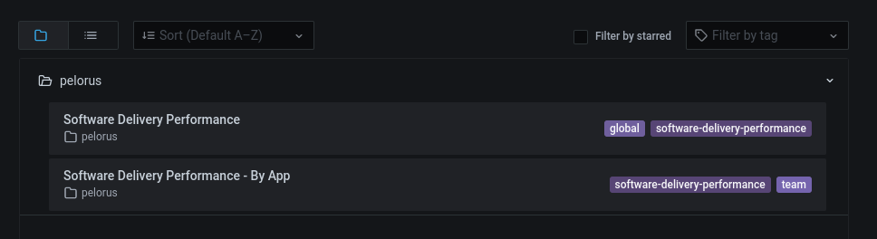
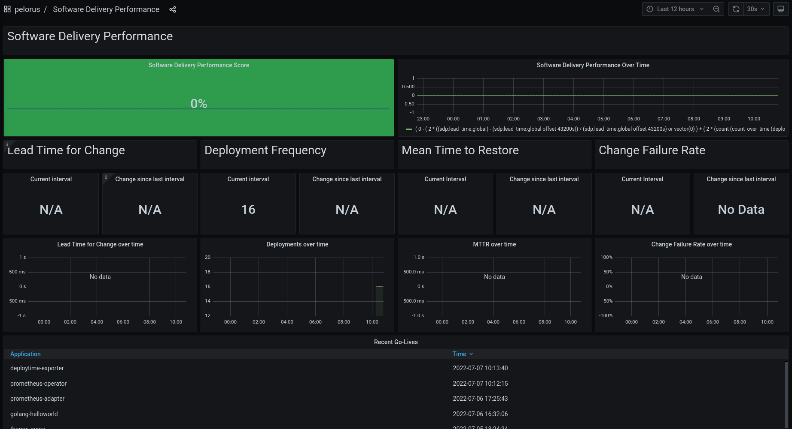

# Pelorus workshop
// TODO: intro to pelorus 

**.Why Pelorus?**
// TODO: Vision with image: https://pelorus.readthedocs.io/en/latest/Philosophy/

**.Architecture**
// TODO: https://pelorus.readthedocs.io/en/latest/Architecture/

## Prerequisites
* OPC 4.7+
* oc cli
* Helm 3

## Installation

**.Clone Pelorus**

In this example we will clone the Pelorus 1.6.0 version

```zsh
git clone --depth 1 --branch v1.6.0 https://github.com/konveyor/pelorus
cd pelorus
```

**.Create the namespace**

I will use the namespace ```pelorus```. Feel free to use another namespace. 

```zsh
oc create namespace pelorus
```

**.Install the operator with Helm**

```zsh
❯ helm install operators charts/operators --namespace pelorus
NAME: operators
LAST DEPLOYED: Thu Jul  7 10:11:49 2022
NAMESPACE: pelorus
STATUS: deployed
REVISION: 1
TEST SUITE: None
```

If we explore the pods, we can see that Pelorus have deployed ```Grafana``` and ```Prometheus``` operators. 

To check it, we find the respective controllers: 

```zsh
❯ oc get pods -n pelorus
NAME                                                   READY   STATUS    RESTARTS   AGE
grafana-operator-controller-manager-85fd5c89bb-qpfgt   2/2     Running   0          8m53s
prometheus-operator-6b495cc576-q54mm                   1/1     Running   0          8m46s
```

**.Run Pelorus**

Once the Operator have been istalled completely, it's time to deploy the Pelorus ecosystem. 

We will use the Pelorus chart:
```zsh
❯ helm install pelorus charts/pelorus --namespace pelorus
NAME: pelorus
LAST DEPLOYED: Thu Jul  7 10:12:36 2022
NAMESPACE: pelorus
STATUS: deployed
REVISION: 1
```

Now, we can check a lot of resources get created:
* Prometheus and Grafana operator (```oc get pod -n pelorus | grep operator```)
* The Pelorus stack
    * A **Prometheus** instance (```oc get route -n pelorus | grep prometheus | awk '{print $2}'```)
    * A **Grafana** instance (```oc get route -n pelorus | grep grafana | awk '{print $2}'```)
    * A **ServiceMonitor** to scrap the metrics (```oc get ServiceMonitor -n pelorus```)
    * A **GrafanaDatasource** to read the information (```oc get GrafanaDatasource -n pelorus```)
    * A set of **GrafanaDashboards** to visualize the information (```oc get GrafanaDashboard -n pelorus```)

**.Customizing Pelorus**

How Pelorus was deployed using Helm, we can override an customize our installation. 

It's as simple as create our own ```values.yaml``` file. 

> NOTE: For more information: https://pelorus.readthedocs.io/en/latest/Configuration/


## Visualize the metrics

In this part, we will check the default metrics, modify the default installation and check our own applications.

### Default metrics

The first is get the url of Grafana:

```zsh
❯ oc get route -n pelorus | grep grafana | awk {'print $2'}
grafana-route-pelorus.apps.<<your-cluster>>.com
```

Login with your user and password into Grafana. Once logged, you can explore the default dashboards:



The first one



// voy por la parte en la que examino 3 ns

## Uninstall

The fisrt step is to uninstall the pelorus stack.

```zsh
❯ helm uninstall pelorus --namespace pelorus
```

Once the stack is totally uninstalled, you can delete the operator:

```zsh 
❯ helm uninstall operators --namespace pelorus
```

And finally, we will delete the namespace:

```zsh
❯ oc delete project pelorus
```